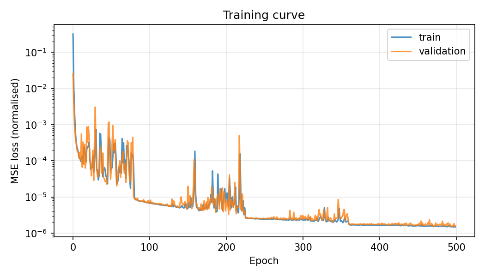
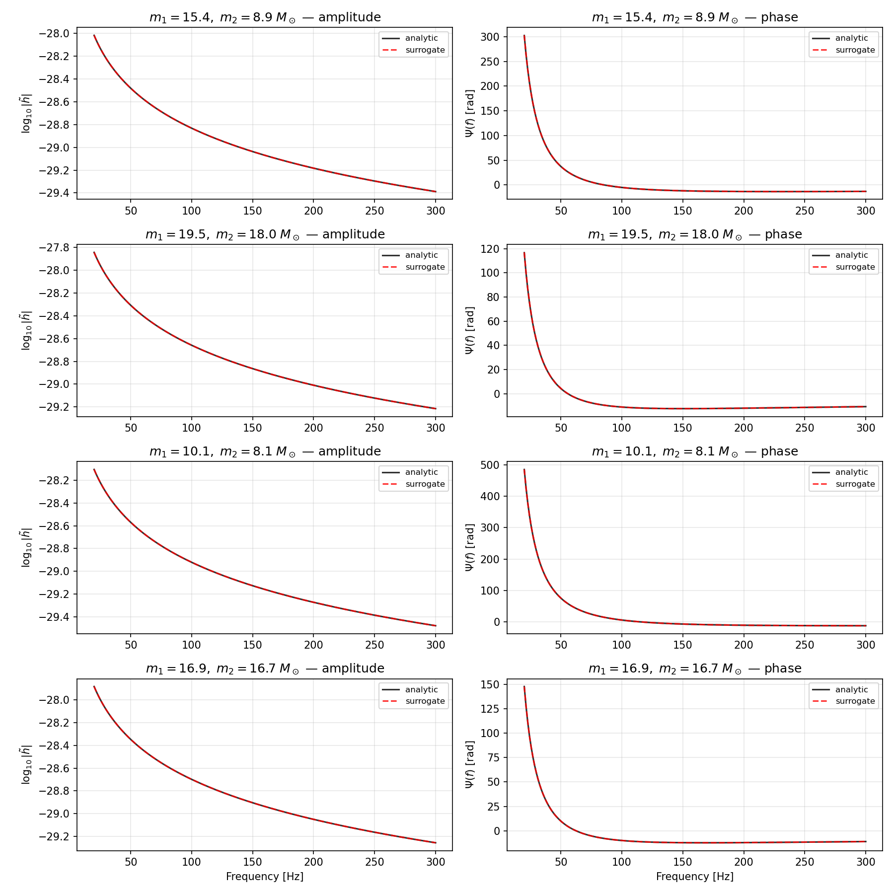
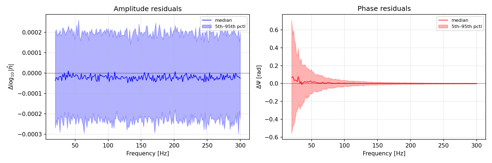
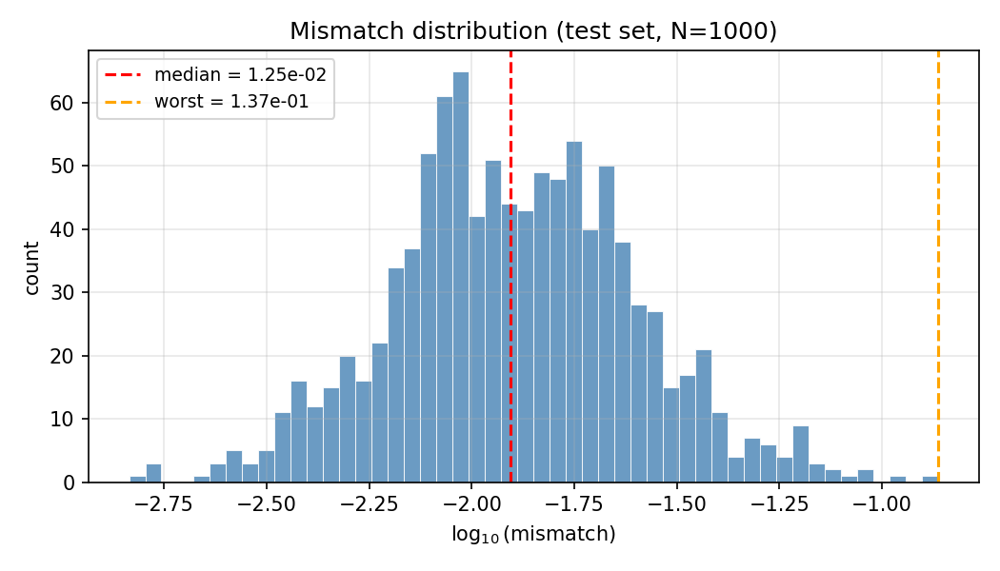

# gw-surrogate

Neural network surrogate model for gravitational waveforms, built as a
weekend learning project.

## Motivation

Gravitational waveform models are a computational bottleneck in
LIGO/Virgo data analysis. Parameter estimation pipelines like MCMC and
nested sampling need millions of waveform evaluations, and even
semi-analytic models like SEOBNRv4 take around 100 ms per call. A trained
neural network that approximates the waveform can be orders of magnitude
faster.

This is the same idea behind surrogate and emulator models in other
domains: replace an expensive physics-based forward model with a fast
neural approximator, trained on a precomputed set of input-output pairs.
Power grid transient simulation, climate modeling, and computational
fluid dynamics all use this pattern.

This project builds a simple version of that. A small fully-connected
network trained to predict inspiral-phase gravitational waveforms from
binary black hole parameters. It follows the framework in Khan and Green
(2021) but uses a stripped-down waveform model and a network small enough
to train on a laptop CPU.

## What it does

The surrogate learns to map two input parameters (component masses m1, m2)
to a frequency-domain gravitational waveform, specifically the
log-amplitude and phase evaluated at 200 frequency points between 20
and 300 Hz.

The ground-truth waveform is TaylorF2 at 1.5 post-Newtonian order, an
analytic inspiral-only approximation computed via the stationary phase
approximation. This is a standard workhorse in GW data analysis, not a
toy model, but it is simpler than the full inspiral-merger-ringdown
waveforms used in production pipelines.

## Results

Training on 10,000 waveforms for 500 epochs takes about 2 minutes on CPU.

Accuracy: median mismatch on the held-out test set is around 1.2%. About
40% of test waveforms have mismatch below 1%, which is roughly the
threshold for detection-adequate surrogates. None reach the 0.1%
threshold needed for unbiased parameter estimation. The amplitude is
learned very well. The phase is the bottleneck, with the largest errors
at low frequencies where the phase diverges as v^{-5}.

Speed: single-waveform inference is slower than the analytic model because
PyTorch overhead dominates for one forward pass. In batch mode (1000
waveforms at once), the surrogate runs at about 1.3 us/waveform, roughly
14x faster than calling the analytic model in a loop. This speedup is
modest because TaylorF2 is already a fast numpy computation. For expensive
ground-truth models like numerical relativity or SEOBNRv4, the same
architecture would give 10^4 to 10^6x speedup.

## What I would do next

Reparameterize the inputs from (m1, m2) to (chirp mass, mass ratio).
The phase evolution depends most directly on chirp mass at leading order,
so this would give the network a more natural mapping to learn.

Train separate sub-networks for amplitude and phase, or use a two-headed
architecture with shared lower layers. The amplitude is almost trivial
(just a power law scaled by chirp mass), while the phase needs most of
the network capacity.

Add a physics-informed loss term. Currently the loss is MSE on the
normalized outputs, which does not directly penalize mismatch. Adding
the mismatch as a loss term would push the network toward the metric
that actually matters for downstream applications.

Extend to a more expensive ground-truth model like SEOBNRv4, where the
speedup from neural approximation is dramatic rather than incremental.

## Setup

    python -m venv .venv
    source .venv/bin/activate
    pip install numpy scipy matplotlib torch tqdm h5py

Or with conda:

    conda env create -f environment.yml
    conda activate gw-surrogate

## Usage

Generate training data (writes HDF5 files to data/):

    python src/generate_data.py

Train the network:

    python src/train.py

Evaluate on test set and run timing benchmark:

    python src/evaluate.py

Exploration plots:

    python exploration.py

## Project structure

    src/generate_data.py   waveform generation and parameter sampling
    src/dataset.py         PyTorch dataset with normalization
    src/model.py           network architecture (4-layer MLP, 301k params)
    src/train.py           training loop with LR scheduling and early stopping
    src/evaluate.py        mismatch computation, comparison plots, timing
    exploration.py         data exploration plots
    figures/               saved plots

## References

Khan and Green (2021), "Gravitational-wave surrogate models powered by
artificial neural networks." Phys. Rev. D 103, 064015.
https://arxiv.org/abs/2008.12936

Buonanno, Iyer, Ochsner, Pan and Sathyaprakash (2009), "Comparison of
post-Newtonian templates for compact binary inspiral signals in
gravitational-wave detectors." Phys. Rev. D 80, 084043.